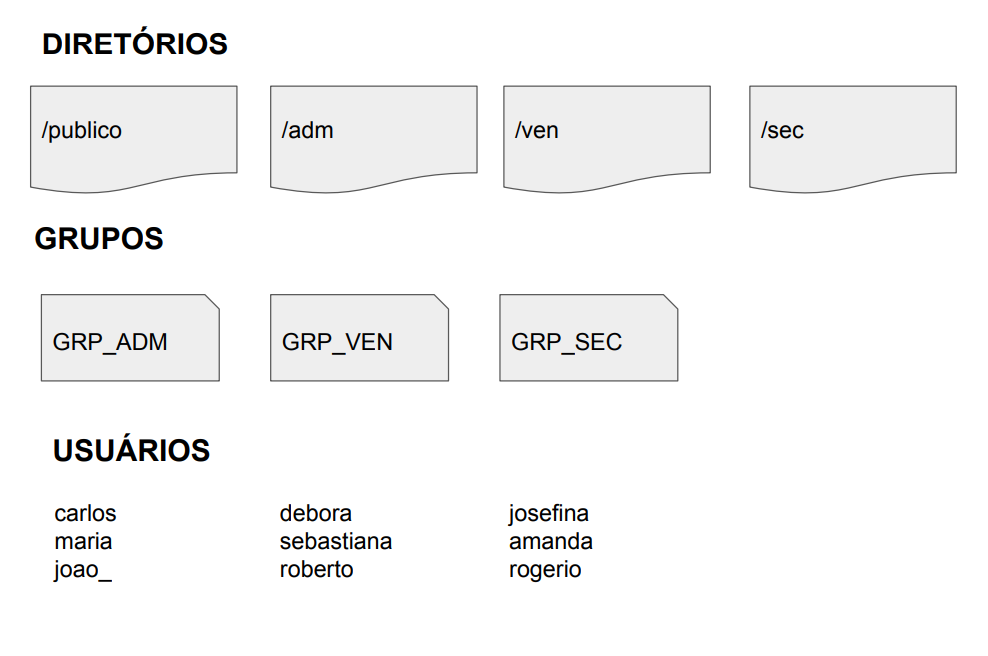

# Infraestrutura como código:
 
## Projeto 1:

Script de criação de **estrutura** de **usuários**, **diretórios** e **permissões**.

*O que é?
Infraestrutura como código (IaC) é o gerenciamento e provisionamento 
da infraestrutura por meio de códigos, em vez de processos manuais.
Com a IaC, são criados arquivos de configuração que incluem as 
especificações da sua infraestrutura, facilitando a edição e a 
distribuição de configurações. Ela também assegura o 
provisionamento do mesmo ambiente todas as vezes.*

 

##Projeto 2:

Script de provisionamento de um 
servidor WEB **(apache)**

*O que é?
Infraestrutura como código (IaC) é o gerenciamento e provisionamento 
da infraestrutura por meio de códigos, em vez de processos manuais.
Com a IaC, são criados arquivos de configuração que incluem as 
especificações da sua infraestrutura, facilitando a edição e a 
distribuição de configurações. Ela também assegura o 
provisionamento do mesmo ambiente todas as vezes.*

 

 * *By: Rodrigo Lopes*

